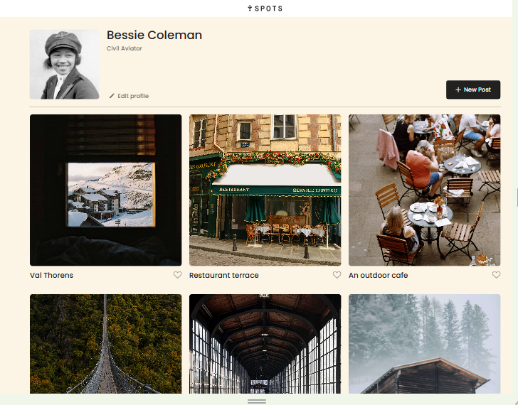

# Project 3: Spots

## Overview

### Project Name:

Spots

### Description:

This project is designed to be an interactive social media web application where users can add and remove photos, and make minor adjustments to their profile.

### Technologies and Techniques used:

-HTML
-CSS
-Figma
-Flexbox
-Media Queries
-BEM

### Images:

### Link

https://ecruz88.github.io/se_project_spots/

https://drive.google.com/file/d/1Ce8XZ8Av09191XPRw19vkWEsc4Px-ihE/view?usp=drive_link

The way you'll do this at work is by exporting images directly from Figma — we recommend doing that to practice more. Don't forget to optimize them [here](https://tinypng.com/), so your project loads faster.

Good luck and have fun!
